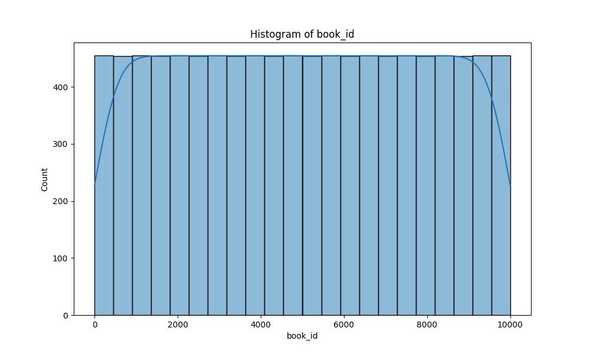

# Automated Dataset Analysis

## Summary
Columns: ['book_id', 'goodreads_book_id', 'best_book_id', 'work_id', 'books_count', 'isbn', 'isbn13', 'authors', 'original_publication_year', 'original_title', 'title', 'language_code', 'average_rating', 'ratings_count', 'work_ratings_count', 'work_text_reviews_count', 'ratings_1', 'ratings_2', 'ratings_3', 'ratings_4', 'ratings_5', 'image_url', 'small_image_url']
Missing Values: {'book_id': 0, 'goodreads_book_id': 0, 'best_book_id': 0, 'work_id': 0, 'books_count': 0, 'isbn': 700, 'isbn13': 585, 'authors': 0, 'original_publication_year': 21, 'original_title': 585, 'title': 0, 'language_code': 1084, 'average_rating': 0, 'ratings_count': 0, 'work_ratings_count': 0, 'work_text_reviews_count': 0, 'ratings_1': 0, 'ratings_2': 0, 'ratings_3': 0, 'ratings_4': 0, 'ratings_5': 0, 'image_url': 0, 'small_image_url': 0}
## Correlation Matrix

## Histograms

## Boxplots

## Insights
### 1. Key Findings and Insights from the Dataset

- **Book Count and Diversity**: The dataset contains 10,000 books, with a wide range of ratings and reviews, indicating a diverse selection of literature. The maximum `books_count` is 3,455, suggesting some books have many editions.

- **Publication Trends**: The `original_publication_year` ranges from -1750 to 2017, with a mean publication year of around 1982, suggesting a mix of classic and contemporary literature. Notably, there are 21 missing values in this column, which may indicate incomplete records for older publications.

- **Rating Insights**: The average rating is approximately 4.00, which is relatively high, indicating that readers generally favor the books in this dataset. The distribution of ratings is heavily skewed towards higher ratings, with `ratings_5` having the highest mean of about 23,790, indicating a tendency for readers to rate books positively.

- **Authors and Language**: The dataset appears to contain a diverse range of authors, with no missing values in the `authors` column. However, there are 1,084 missing values in the `language_code` column, which could impact insights regarding the linguistic diversity of the books.

### 2. Patterns and Trends Observed in the Data

- **Ratings Distribution**: The ratings distribution shows a clear trend where most books receive a higher number of 4 and 5-star ratings. For instance, the mean for `ratings_5` (23,789) is significantly higher than `ratings_1` (1,345), indicating that readers are inclined to rate books positively.

- **Correlation Insights**: There is a notable negative correlation between `ratings_count` and `average_rating` (-0.373), suggesting that books with a higher number of ratings may not necessarily receive the highest average ratings. This could imply that popular books have more varied opinions or that newer books tend to receive higher ratings.

- **Text Reviews**: The average number of text reviews (`work_text_reviews_count`) is relatively low (about 2,920), which could point to the fact that while readers may rate books, they do not always leave detailed written reviews. This could be an area for further exploration to understand reader engagement.

### 3. Potential Anomalies or Outliers and Their Implications

- **Outliers in Ratings**: There are significant outliers in the `ratings_1` through `ratings_5` columns, particularly in `ratings_5`, which has a maximum of 3,011,543. These outliers could skew the average, suggesting that some books are exceptionally popular or have received a disproportionate number of high ratings.

- **Publication Year Anomalies**: The `original_publication_year` has extreme values such as -1750, which is likely an error. This could distort analyses related to publication trends, necessitating further cleaning of the dataset to ensure accurate representation.

### 4. Suggestions for Further Analysis or Steps to Take Based on the Data

- **Data Cleaning**: Address missing values, particularly in `isbn`, `isbn13`, `original_title`, and `language_code`, and investigate the extreme values in `original_publication_year`. Cleaning these issues will improve the reliability of insights drawn from the dataset.

- **Detailed Analysis of Reviews**: Perform a deeper analysis into the text reviews, possibly by categorizing them into positive, negative, and neutral sentiments to understand reader sentiments more effectively.

- **Exploring Language Impact**: Investigate the impact of language on ratings and review counts, especially given the high number of missing values in `language_code`.

- **Time Series Analysis**: Consider a time series analysis of publication years against average ratings to see how reader preferences for genres or authors have evolved over time.

### 5. Additional Observations or Recommendations

- **Genre Exploration**: If genre information is available, including it in the analysis could provide insights into which genres are rated highest and have the most reviews.

- **Author Popularity**: Analyzing the frequency of author appearances in the dataset could provide insights into trends in author popularity and their correlation with ratings and reviews.

- **User Engagement Metrics**: Incorporating user engagement metrics, such as the time taken to read books or the frequency of reviews per user, could add depth to the analysis of reader interactions with the books.

- **Visualization**: Consider creating visualizations (such as histograms for ratings distribution or heatmaps for correlation) to better communicate trends and insights derived from the data.

By addressing these points, one can derive more actionable insights and enhance the understanding of the dataset and its implications in the literary community.